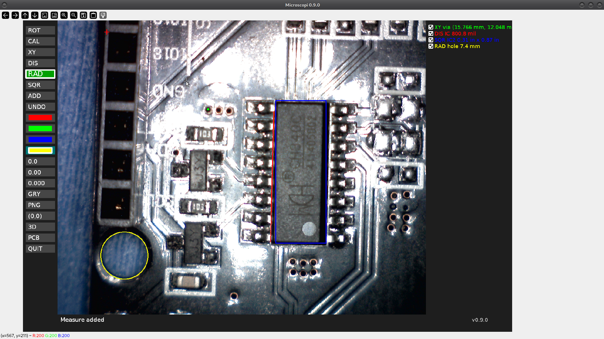

# Microscopi

**Microscopi** is an open-source digital microscope measurement tool for Linux.

It provides real-time calibrated measurement, coordinate export and PCB-oriented workflows using any V4L2 compatible camera (USB microscopes, webcams, etc.).

Designed for precision work in electronics, PCB reverse engineering, mechanical prototyping and laboratory environments.

---

## ✨ Features

### 📐 Measurement Modes

- **DIS** – Distance  
- **RAD** – Radius / Diameter  
- **SQR** – Rectangle  
- **XY** – Point coordinates  

### 🎯 Calibration

- Calibration in mm or inches  
- Display units: mm, inch, mil (thousandth of an inch)  
- Configurable precision (0.0 / 0.00 / 0.000)  
- Define custom origin (0,0)  
- Keyboard shortcut **B** for fast calibration  

### 🔄 Rotation

- 0° / 90° / 180° / 270°  
- Geometrically consistent model/view separation  
- Measurements remain accurate under any rotation  

### 🖥 Visual Features

- Optional grayscale mode (image only, overlays remain in color)  
- Persistent overlays with visibility toggle  
- JSON-based measurement editor (key **M**)  
- UTF-8 text rendering (OpenCV FreeType)  
- Real-time preview while measuring  
- High-contrast dual crosshair cursor  

### ⌨ Keyboard Shortcuts

- **D / C / S / X** → measurement modes  
- **R** → rotate  
- **G** → grayscale toggle  
- **B** → calibrate  
- **M** → JSON measure editor  
- **Z** → undo  
- **V / U** → unit switching  

### 🧾 JSON Measure Editor

Press **M** to open the full measurement editor.

- Edit labels  
- Modify colors  
- Reorder measures  
- Delete or duplicate measures  
- Full structural validation before applying changes  

This enables advanced workflows and precise manual adjustments.

### 💾 Persistence

- Remembers last video device  
- Remembers last resolution  
- Stored in `~/.config/microscopi/config.json`  

### 📤 Export Modes

- **PNG** – image only  
- **3D** – PNG + CSV (mm)  
- **PCB** – PNG + CSV (mil)  

CSV export includes:

- Label  
- Measurement type  
- Color code  
- Coordinates (relative to origin)  
- Measured value  

---

## 🔬 Tested Hardware Matrix

Microscopi has been tested with the following devices and configurations.

| Device | Type | Connection | Status | Notes |
|--------|------|------------|--------|-------|
| Chronos USB 2.0 Digital Microscope | USB microscope | V4L2 | ✔ Fully functional | Resolution control supported |
| Silicon Motion 300k Pixel Camera | USB camera | V4L2 | ✔ Fully functional | Low native resolution |
| ESP32-CAM (CameraWebServer example) | Embedded WiFi camera | HTTP MJPEG | ✔ Fully functional | Resolution set in firmware |
| Android phone (IP Webcam app) | Smartphone camera | HTTP MJPEG | ✔ Fully functional | 1280×720 or higher recommended |

---

### USB Devices (V4L2)

Standard V4L2-compatible USB microscopes and webcams are supported.

Resolution can be controlled via command line:

    microscopi -d 2 -r 1280x720

---

### Network Cameras (HTTP / MJPEG)

Microscopi supports MJPEG streams via HTTP, including:

- ESP32-CAM
- Android IP Webcam
- IP cameras with MJPEG endpoints

Example:

    microscopi -d http://192.168.1.120:8080/video

Resolution is controlled by the stream source.

---

### Notes

- OpenCV must be built with FFMPEG support for HTTP/RTSP streams.
- Higher resolutions improve calibration accuracy.
- Network latency depends on WiFi and device performance.

Additional compatibility reports are welcome.  
If you successfully test Microscopi with new hardware, please share details in the **Hardware compatibility** discussions.

---

## 📦 Dependencies (Debian)

Microscopi requires:

- python3  
- python3-opencv (with FreeType support)  
- python3-tk  
- gettext  

Install with:

    sudo apt install python3 python3-opencv python3-tk gettext

If OpenCV was built without FreeType support, the program will not start.

---

## Installation

### Debian / Ubuntu (Recommended)

Download the latest `.deb` package from **Releases** and install:

    sudo dpkg -i microscopi_0.12.0-1_amd64.deb
    sudo apt -f install

After installation, launch Microscopi from:

- Application menu  
or  
- Terminal:

    microscopi

---

## ⚙ Command Line Options

Microscopi can optionally be started with custom parameters:

| Option | Description |
|--------|------------|
| `-d` | Video device index |
| `-r` | Resolution (e.g. 1280x720) |
| `-n` | Number of decimals |
| `--unit` | Default unit (mm or in) |
| `--no-draw-live` | Disable live preview drawing |

If no device or resolution is specified, Microscopi will use the last working configuration.

---

## 📏 Typical Workflow

1. Rotate image if needed.  
2. Calibrate using a known reference.  
3. Select measurement mode (DIS / RAD / SQR / XY).  
4. Add measurement with label.  
5. Optionally define origin (0,0).  
6. Edit measurements (M) if needed.  
7. Export using PNG / 3D / PCB.  

---

## 📂 Export Details

### PNG

Saves the current image with visible overlays.

### 3D

Saves:
- PNG image  
- CSV file in millimeters (1 decimal)  
- Coordinates relative to origin  

### PCB

Saves:
- PNG image  
- CSV file in mil (integer precision)  
- Coordinates relative to origin  

---

## 📄 CSV Format

CSV contains:

    label,type,color,x1,y1,x2,y2,value

Coordinates are:
- Relative to defined origin  
- In mm (3D mode)  
- In mil (PCB mode)  

---

## 🧱 Architecture

Microscopi uses a modular architecture:

- `video.py` → video source abstraction  
- `renderer.py` → rendering pipeline  
- `preview.py` → live preview layer  
- `state.py` → application model  
- `actions.py` → measurement and export logic  
- `input.py` → mouse and keyboard handling  

Rendering separates:

- Model coordinates (base system)  
- Visual coordinates (rotated system)  

This ensures geometrical consistency and future extensibility.

---

## 📌 Version

Current version: **0.12.0**

---

## 📜 License

MIT License

---

## Roadmap

- [x] Debian package  
- [x] i18n  
- [x] CSV export  
- [x] Geometrically consistent rotation  
- [x] JSON measurement editor  
- [ ] Hardware profile presets  
- [ ] Session save/load  
- [ ] Debian official submission  

---

## 👤 Author

Created by Jordi Orts  
Open source contribution inspired by the Debian community.
